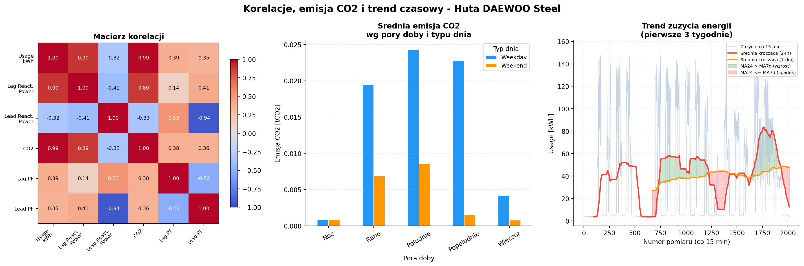

# steel-energy-analysis
Data analysis of steel industry energy consumption - Python, Pandas, Matplotlib
# Steel Energy Analysis

Analiza zuzycia energii elektrycznej w hucie stali DAEWOO Steel Co. Ltd
(Gwangyang, Korea Poludniowa) na podstawie danych z UCI Machine Learning Repository.

## Opis projektu

Zbior danych zawiera ponad 35 000 pomiarow co 15 minut przez caly rok.
Celem projektu bylo odpowiedzenie na trzy pytania badawcze:

1. Jak zmienia sie zuzycie energii w zaleznosci od dnia tygodnia i typu dnia?
2. Czy istnieje zwiazek miedzy emisja CO2 a moca bierna opozniona?
3. O jakiej porze doby zuzycie energii jest najwieksze?

## Wnioski

- Dni robocze maja srednie zuzycie 32-35 kWh, niedziela spada do 7.55 kWh (22% wartosci czwartkowej)
- Emisja CO2 jest scisle proporcjonalna do zuzycia energii - korelacja bliska 1
- Szczyt zuzycia przypada na godziny 11-20 (Poludnie i Popoludnie)
- Rozklad zuzycia jest silnie prawostronnie skosny - mediana (4.57 kWh) wielokrotnie nizsza od sredniej (27.39 kWh)

## Technologie

- Python 3
- Pandas
- Matplotlib
- NumPy
- UCI ML Repository (`ucimlrepo`)

## Struktura projektu

```
steel-energy-analysis/
├── projekt_steel_final.ipynb   # kompletny notatnik analityczny
├── dashboard_steel.png          # eksport dashboardu (200 dpi)
└── README.md
```

## Wizualizacje

Dashboard zawiera 8 wykresow (7 roznych typow):
- Wykres slupkowy z GridSpec i adnotacja - rytm tygodniowy
- Histogram z liniami mediany i sredniej - rozklad zuzycia
- Barh - zuzycie wg pory doby
- Scatter - emisja CO2 vs moc bierna
- Boxplot - zuzycie wg jakosci wspolczynnika mocy
- Heatmapa korelacji
- Grouped bar z pivot table - emisja CO2 wg pory doby i typu dnia
- Szereg czasowy ze srednimi kroczacymi i fill_between



## Zrodlo danych

Sathishkumar V E, Changsun Shin, Yongyun Cho.
Steel Industry Energy Consumption Dataset.
UCI Machine Learning Repository, 2021.
https://archive.ics.uci.edu/dataset/851
